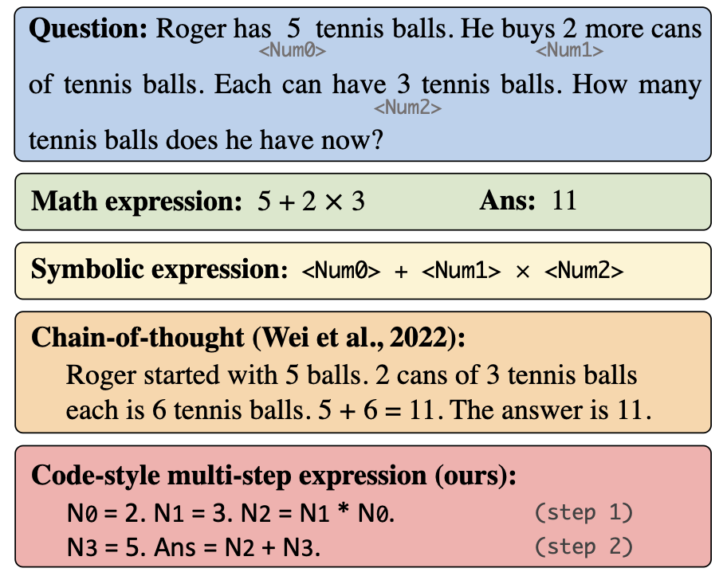

## MsAT: Learning Multi-step Reasoning from Arithmetic Task

### Overview

Motivated by large language models' impressive reasoning abilities elicited by the *chain-of-thought prompting* ([Wei et al., 2022](https://arxiv.org/abs/2201.11903)), we propose to inject multi-step reasoning ability into relatively small LMs (e.g., RoBERTa) by pre-training them on a synthetic dataset MsAT. 

Our experiments are conducted with two backbone models: a Seq2Seq model [RoBERTaGen](https://github.com/LYH-YF/MWPToolkit) which augments RoBERTa with a transformer decoder, and a Seq2DAG model [DeductReasoner](https://github.com/allanj/Deductive-MWP) that combines RoBERTa with a directed-acyclic-graph decoder.




### Install dependencies

All our experiments are conducted with Python 3.8 and PyTorch v1.12.0. Please first install PyTorch v1.12.0 from [the official link](https://pytorch.org/get-started/previous-versions/). To install other dependencies, please run the following script:
```bash
pip install -r requirements.txt
```

### Pre-training on MsAT

The core idea of our method is to inject multi-step reasoning skills into models by pre-training them on the proposed synthetic dataset MsAT.


We have released the weights of pre-trained models on Huggingface Model Hub. 

|              Models              | MsAT Acc.|
|:-------------------------------|:--------:|
|  [Tianduo/MsAT-DeductReasoner](https://huggingface.co/Tianduo/MsAT-DeductReasoner) |   99.0 |
| [Tianduo/MsAT-RoBERTaGen](https://huggingface.co/Tianduo/MsAT-RoBERTaGen) |   96.1  |

You may simply load the pre-trained weights using the following code before fine-tuning on downstream MWP tasks (take RoBERTaGen as an example).

```python
from robertagen.model import RoBERTaGen, HFRoBERTaGen, RoBERTaGenConfig

hf_config = RoBERTaGenConfig.from_pretrained('Tianduo/MsAT-RoBERTaGen')
model_args = RoBERTaGen.parse_model_args(hf_config.to_diff_dict())
model = HFRoBERTaGen.from_pretrained(
   'Tianduo/MsAT-RoBERTaGen', 
   config=hf_config, 
   pytorch_model=RoBERTaGen(model_args))
```

Or you can train your own MsAT-RoBERTaGen using the following code:
```bash
python robertagen/train.py -c robertagen/config/msat.yaml
```
All the necessary training hyperparameters are organized in YAML files.


#### MsAT construction (optional)

One of the advantages of using synthetic data for pre-training is the customizability.
Run the following code to create a new MsAT dataset:
```bash
python data/make_msat_data.py --total_num 85000 --train_num 80000 --difficulty 2.4
```
Arguments are explained here:
- `--total_num`  number of training data + number of test data
- `--train_num`  number of training data
- `--difficulty` the difficulty level of MsAT 

### Fine-tuning on Math Word Problem datasets
For example, to fine-tune MsAT-RoBERTaGen on SVAMP, we can run the following command:

```bash
python robertagen/train.py -c robertagen/config/svamp.yaml
```


## Evaluation

Our fine-tuned model checkpoints (on SVAMP) are released on Huggingface Model Hub.

|              Models              | SVAMP Acc.|
|:-------------------------------|:--------:|
|  [Tianduo/MsAT-DeductReasoner-SVAMP](https://huggingface.co/Tianduo/MsAT-DeductReasoner-SVAMP) |   48.8 |
| [Tianduo/MsAT-RoBERTaGen-SVAMP](https://huggingface.co/Tianduo/MsAT-RoBERTaGen-SVAMP) |   39.9  |


Run the following code to evaluate the models:
```python
python deductreasoner/evaluate.py -m Tianduo/MsAT-DeductReasoner-SVAMP -d svamp
```
```python
python robertagen/evaluate.py -m Tianduo/MsAT-RoBERTaGen-SVAMP -d svamp
```

Arguments for the evaluation scripts are explained here:
- `-m` name or address of the model checkpoint
- `-d` evaluation dataset

### Citation

```bibtex
@inproceedings{wang2023msat,
   title={Learning Multi-step Reasoning from Arithmetic Task},
   author={Wang, Tianduo and Lu, Wei},
   booktitle={Proceedings of ACL},
   year={2023}
}
```
